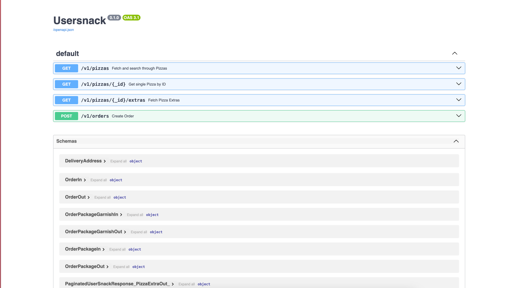

# UserSnack
A minimalistic pizza ordering API service built with [FastAPI](https://fastapi.tiangolo.com/) and 
[TortoiseORM](https://tortoise.github.io).

## ✍🏾 Project Philosophy
- The project is based on the service-repository pattern. 
- The idea behind using a repository despite using a library like Tortoise-ORM is to be able to abstract 
complex database queries and do easy mocking as scale during unit tests.

## 💻 Development Setup
- Copy `.env.sample` to `.env` and set the values as necessary.

### 1️⃣ All in Docker Compose
Run:
```shell
docker compose up
```

### 2️⃣ App outside of Docker
This could be useful if you need to attach a debugger to your application. As a requirement, you'd need to have 
[Poetry](https://python-poetry.org/) installed. Then you may follow the steps:

- Start only the Database in docker if you don't have any existing server on your machine.
```shell
docker compose up db -d
```

- Override the default database config by adding the following to your gitignored `.env`:

```
POSTGRES_HOST=localhost
POSTGRES_PORT=5438
```

_The host port map is changed in this project to avoid conflict with existing Postgres on host machine._

```shell
export PYTHONPATH=src # you only need to set this once in your terminal session
python -m uvicorn main:app --reload
```

###  ♼ Migrations
Migrations are managed with [Aerich](https://github.com/tortoise/aerich) (a migration tool by Tortoise-ORM). To 
run migrations:

```shell
# Outside docker setup
aerich upgrade

# Full docker compose setup
docker compose exec app aerich upgrade
```

### 🌱 Seed Data
Some default pizzas and pizza extras can be available by default over the API. To seed your new database with them:

```shell
# Outside docker setup (assumes the terminal session still has the PYTHONPATH=src)
python scripts/load_fixtures.py

# Full docker compose setup
docker compose exec app python scripts/load_fixtures.py
```

Once started up, ideally, you should be able to access the project documentation over http://localhost:8000/docs 
if no custom port settings were done.



## 🥷🏼 Linting & Formatting
[Flake8](https://flake8.pycqa.org/en/latest/) is used for linting while [Black](https://github.com/psf/black) is used 
for code formatting. To run both respectively:

```shell
# Format code
./scripts/format.sh

# Lint code
./scripts/lint.sh
```

## 🧪 Testing
[Pytest](https://pytest.org) is used for testing in the project, and currently both unit tests and integration tests are ran together 
(can be improved to split into individuals). To run tests:

```shell
pytest -s
```

You would need your database to be running in order to execute the integration tests successfully.


## 🌌 Media Files
In development/test environment, FastAPI serves the media files, but these requests are served by the webserver in 
Production.

## 🧢 Project Assumptions
- No authentication required.
- Scope does not include the logistics flow after ordering action.

## 🪂 Deployment
You can set up the project on a single node machine with docker.

- Clone the project
- Copy `.env.sample` to `.env` and set the values as necessary.
- Modify `HOST_DOMAIN` environment in the `caddy` service of `docker-compose.yml`; set to your domain, and ensure that 
the domain is equally pointing to your remote machine IP address.
- Run `docker-compose.yml`.
- Your API documentation should be accessible over `https://<your-domain>/docs`, and media over `https://<your-domain>/media/<path-to-media>`

## 🪡 Improvements / Scale Production
- Phone number validation
- Add CI
- Use an container orchestration tool like k8s at scale
- Manage postgres connections with tool like PgBouncer to reduce the time spent opening and closing connections (reuse connections).
- Generate typescript client that the react FE can use. 
- Caching using Redis/memcache or similar tool.
- JSON logging 
- More unit tests for the services / repositories
- Use factories to generate test data
- Split unit and integration tests
